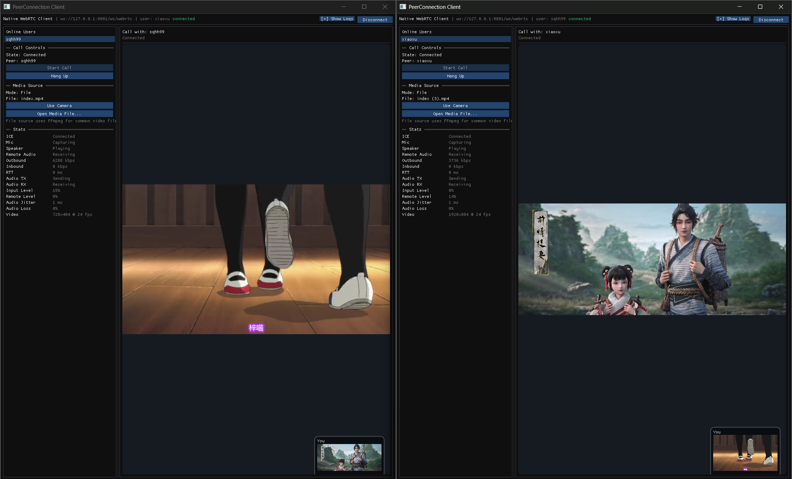

# peerconnection_client

A Windows-only WebRTC desktop client built with C++, SDL3, ImGui, Boost.Beast, and a custom signaling server.

## Screenshot



## Features

- 1:1 audio/video calling
- camera and media-file video source switching
- real-time call stats in the sidebar
- repeated-call handling fixes for stale signaling, ICE timing, and one-way video regressions

## Requirements

- Windows
- Visual Studio C++ build tools
- `clang-cl`
- `cmake`
- `ninja`

## Build

Use the batch script from a normal Windows shell or Developer Command Prompt.

```bat
build.cmd clean
build.cmd
build.cmd debug
```

Notes:

- default build is `release`
- build output lives under `build\release` or `build\debug`
- `build.cmd clean` removes the whole `build\` directory
- `build\compile_commands.json` is synchronized from the active config directory after configure/build

## CMake preset

This repository also provides a default Ninja preset:

```bat
cmake --preset default
cmake --build --preset default
```

## Signaling server

The client expects the matching signaling service in:

```text
webrtc-signaling-server/
```

Update the server URL in the app configuration if your deployment target changes.

## Documentation

- Repeated-call video bug analysis:
  [docs/webrtc-repeat-call-video-debugging.md](docs/webrtc-repeat-call-video-debugging.md)

## License

BSD 3-Clause. The project license is aligned with the WebRTC source license style.
